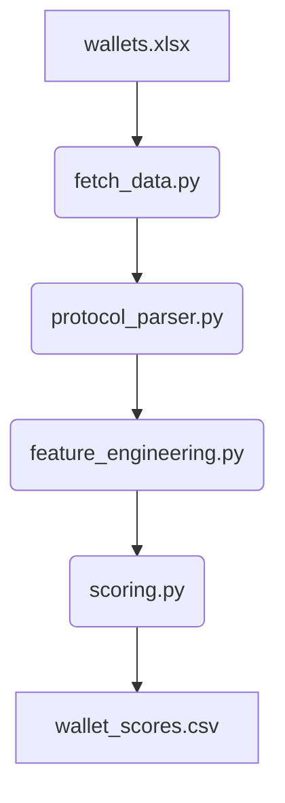

# 📘Wallet Risk Scoring Using Compound Protocol (V2 + V3)

## 📌 Project Overview

This project assigns a **risk score (0–1000)** to Ethereum wallet addresses based on their historical on-chain behavior with the **Compound lending protocol**, supporting both:

- ✅ **Compound V2** (cTokens on Ethereum)
- ✅ **Compound V3** (Comet markets across Ethereum & other chains)

Wallets are evaluated for risk based on behaviors such as:
- Borrowing but not repaying
- Getting liquidated
- Frequently borrowing again after repaying
- Lack of supply collateral

## ⚙️ How the System Works



1. **Fetch wallet transactions** from Etherscan
2. **Parse transactions** to extract Compound protocol activity
3. **Engineer features** to measure wallet behavior
4. **Score** wallets using percentile-based statistical model
5. **Output** final scores for analysis

## 🧑‍💻 Setup Instructions

### ✅ Step 1: Install dependencies
```bash
pip install -r requirements.txt
```

### ✅ Step 2: Add your API key
Add your Etherscan API key to a `.env` file in the project root directory:
```bash
ETHERSCAN_API_KEY=your_api_key_here
```

### ✅ Step 3: Provide wallet list
Place your wallet file at:
```
data/wallets.xlsx
```
- The file should contain one column of wallet addresses.

## 🚀 Run the Project

Run the full pipeline:

```bash
python -m src.pipeline
```

This will produce:

- `data/output/wallet_scores.csv`
- `data/processed_features/wallet_features.csv`

## 📊 Output Format

### ➤ `wallet_scores.csv`
```csv
wallet,score
0xabc123...,742
0xdef456...,312
```

### ➤ `wallet_features.csv`
Includes advanced features:
```csv
wallet,total_txns,borrow_count,repay_count,liquidation_count,...
```

## 📈 Analyzing Results

Use the included Jupyter notebook:
```bash
jupyter notebook notebooks/exploratory_analysis.ipynb
```

It will:
- Plot the score distribution
- Identify top risky wallets
- Count wallets in each risk band

## 📘 Assignment Deliverables

### ✅ Data Collection Method
- Used **Etherscan API** to pull all transaction history for each wallet
- Filtered interactions with **Compound V2 cTokens** and **Compound V3 Comet contracts**

### ✅ Feature Selection Rationale
Extracted 15+ behavioral features, including:
- Borrow/repay ratio
- Liquidation ratio
- Activity span in days
- Re-borrow frequency
- Supply to borrow coverage

These are directly linked to real-world lending risk.

### ✅ Scoring Method
- Used **percentile ranking** for each feature (no hardcoded cutoffs)
- Weighted each behavior’s influence on score
- Final score = **0 (high risk)** to **1000 (low risk)**

### ✅ Justification of Risk Indicators
| Indicator | Why It's Important |
|-----------|---------------------|
| `liquidation_count` | Shows protocol intervention due to risk |
| `repay_consistency` | Indicates repayment discipline |
| `net_borrow_score` | Captures long-term borrow exposure |
| `reborrow_rate` | Flags aggressive borrow habits |
| `tx_activity_span_days` | Stability & protocol familiarity |

## ✅ Risk Categories (Score Tiers)

| Score Range | Risk Level    |
|-------------|---------------|
| 0–300       | High Risk 🔴   |
| 400–700     | Medium Risk 🟠 |
| 800–1000    | Low Risk 🟢    |

## 🔒 Security Notes

- Your **Etherscan API key** is securely stored in `.env`, which is excluded via `.gitignore`
- Sensitive data and intermediate results are never committed

## 📁 Directory Structure

```
wallet-risk-scoring/
├── data/
│   ├── wallets.xlsx
│   ├── raw_transactions/
│   ├── features/
│   ├── processed_features/
│   └── output/
├── notebooks/
│   └── score_analysis.ipynb
├── src/
│   ├── config.py
│   ├── fetch_data.py
│   ├── protocol_parser.py
│   ├── feature_engineering.py
│   ├── scoring.py
│   └── pipeline.py
├── requirements.txt
├── .gitignore
└── README.md
```

## ✅ Future Improvements

- Add support for other lending protocols (e.g., Aave, Morpho)
- Use unsupervised ML to cluster wallet behaviors
- Track credit evolution over time
